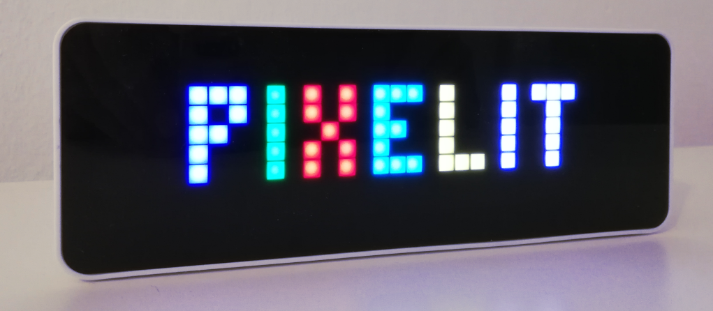
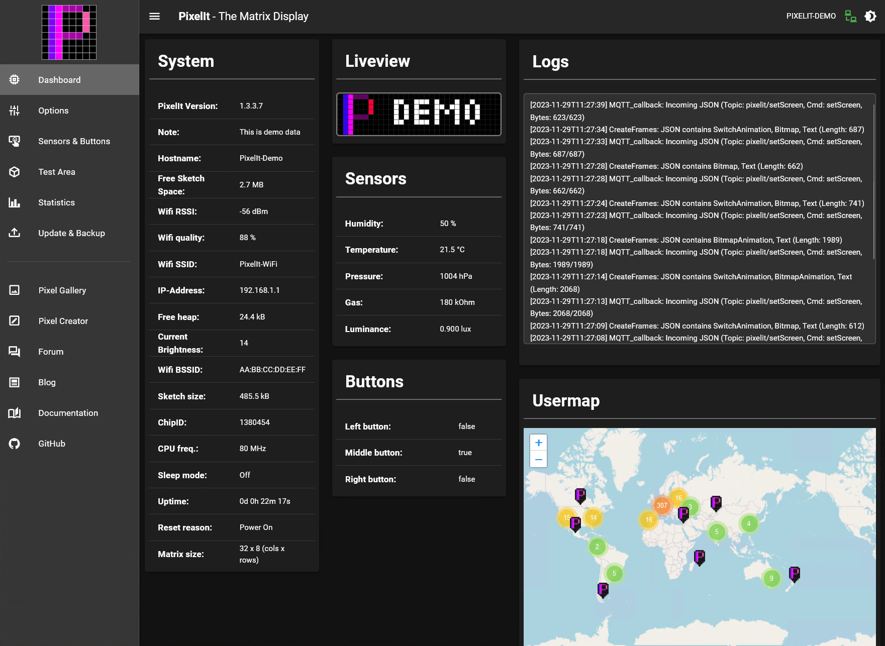

# PixelIt - The Matrix Display

     

The PixelIt is an ESP8266/ESP32 and WS2812B-LED based PixelArt display, controlled and fed via a JSON API.
Settings and small tests are possible via the web interface,
also a Node-RED node ([node-red-contrib-pixelit](https://flows.nodered.org/node/node-red-contrib-pixelit)) for the JSON API is available.

If you want to get an impression of the WebUI, you can do that here in [Demo WebUI](https://pixelit-project.github.io/PixelIt/webui/) :rocket:

-   :memo: [Documentation](https://pixelit-project.github.io/)
-   :green_heart: [PixelIt Icon Gallery (in Demo WebUI)](https://pixelit-project.github.io/PixelIt/webui/#/gallery)
-   :bulb: [GitHub Discussions (Forum)](https://github.com/pixelit-project/PixelIt/discussions) 
-   :speech_balloon: [Telegram Channel](https://t.me/pixelitdisplay) 
-   :speech_balloon: [Discord Channel](https://discord.gg/ERBSHWxB2S) 

## Project highlights

-   :fire: Support for **[Node-RED](https://pixelit-project.github.io/nodered.html)**, **[HomeAssistant](https://pixelit-project.github.io/webinterface.html#mqtt)** and **[ioBroker](https://pixelit-project.github.io/iobroker.html)**
-   :fire: Support for **[DIY Matrixes](https://pixelit-project.github.io/hardware.html#parts-list)** (ESP32/ESP8266) and prebuild **[Ulanzi TC001 Pixel Clock](https://www.ulanzi.com/products/ulanzi-pixel-smart-clock-2882?aff=1181)**\*
-   :fire: Awesome [WebUI](https://pixelit-project.github.io/PixelIt/webui/) for configuration and control. Checkout the **[Demo](https://pixelit-project.github.io/PixelIt/webui/)**
-   :fire: Great **[documentation](https://pixelit-project.github.io/)**
-   :fire: Unlimited possibilities through the open **[API](https://pixelit-project.github.io/api.html)**
-   :fire: Helpful and welcoming community on **[Telegram](https://t.me/pixelitdisplay)**, **[Discord](https://discord.gg/ERBSHWxB2S)** and **[GitHub Discussions](https://github.com/pixelit-project/PixelIt/discussions)**
-   :fire: Showroom for your own PixelIt builds on the **[Show you PixelIt](https://github.com/pixelit-project/PixelIt/discussions/48)** thread.

## Contributors

Thanks to these great people for supporting this project.

<!-- readme: contributors -start -->
<table>
<tr>
    <td align="center">
        <a href="https://github.com/o0shojo0o">
            
             
            <b>o0shojo0o</b>
        </a>
    </td>
    <td align="center">
        <a href="https://github.com/foorschtbar">
            
             
            <b>foorschtbar</b>
        </a>
    </td>
    <td align="center">
        <a href="https://github.com/miccgn">
            
             
            <b>miccgn</b>
        </a>
    </td>
    <td align="center">
        <a href="https://github.com/jekader">
            
             
            <b>jekader</b>
        </a>
    </td>
    <td align="center">
        <a href="https://github.com/Metaln00b">
            
             
            <b>Metaln00b</b>
        </a>
    </td>
    <td align="center">
        <a href="https://github.com/pplucky">
            
             
            <b>pplucky</b>
        </a>
    </td></tr>
<tr>
    <td align="center">
        <a href="https://github.com/fmunozs">
            
             
            <b>fmunozs</b>
        </a>
    </td>
    <td align="center">
        <a href="https://github.com/rozza-m">
            
             
            <b>rozza-m</b>
        </a>
    </td>
    <td align="center">
        <a href="https://github.com/hermannbach">
            
             
            <b>hermannbach</b>
        </a>
    </td>
    <td align="center">
        <a href="https://github.com/d4rkd3v1l">
            
             
            <b>d4rkd3v1l</b>
        </a>
    </td>
    <td align="center">
        <a href="https://github.com/hamster65">
            
             
            <b>hamster65</b>
        </a>
    </td>
    <td align="center">
        <a href="https://github.com/rliegmann">
            
             
            <b>rliegmann</b>
        </a>
    </td></tr>
</table>
<!-- readme: contributors -end -->

## WebUI

## Changelog

<!-- ** WORK IN PROGRESS ** -->

### 2.5.1 (2023-03-22)

-   (rliegmann) Fixed ESP32 Pin Definition
-   (foorschtbar) Fixed build issue with MAX44009 lib

### 2.5.0 (2023-11-20)

-   (foorschtbar) Fixes "MQTT message is to long" [[#322](https://github.com/pixelit-project/PixelIt/issues/322)]
-   (o0shojo0o) Adjustments in the WebUI for the new API structure of the UserMap endpoint
-   (o0shojo0o) Also now in the WebUI Improved check of new firmware through a real version comparison
-   (o0shojo0o) Added config backup and restore to WebUI [[#319](https://github.com/pixelit-project/PixelIt/issues/319)]
-   (o0shojo0o) Added Statistics to WebUI
-   (jekader) Added large 8px non-bold clock font [[#320](https://github.com/pixelit-project/PixelIt/pull/320)]
-   (foorschtbar) Made HomeAssistant service discovery configurable
-   (foorschtbar) Added optional MQTT device topic (`<Mastertopic>/<Hostname>/<commands>`)

### 2.4.3 (2023-10-17)

-   (foorschtbar) Native support for [Ulanzi TC001 Pixel Clock](https://www.ulanzi.com/products/ulanzi-pixel-smart-clock-2882?aff=1181)\* :tada:
-   (foorschtbar) Display `zZz` on the matrix when the device going to sleep
-   (foorschtbar) Fixed issue with flickering icons, wenn device wake from sleep mode
-   (Metaln00b) Improved new firmware check by doing real version compare (major, minor, patch and prerelease)
-   (o0shojo0o) As of this version, it is possible to install via the new [webflasher](https://pixelit-project.github.io/firmware.html#flashing-web)
-   (jekader) Remove duplication from platformio.ini [[#315](https://github.com/pixelit-project/PixelIt/issues/315)]
-   (foorschtbar) MQTT/Websocket message interval for sensors and matrix info are now minimum 10 seconds to reduce "noise" on the network
-   (foorschtbar) Added support for SHT31 sensor
-   (foorschtbar) Log error if MQTT or Websocket message is to long
-   (jekader) Improve logging during pin assignment
-   (foorschtbar) Added build section from PIO config to matrix info and telemetry data

### 2.3.2 (2023-09-16)

-   (foorschtbar) Added live preview (liveview) of the Matrix to WebUI
-   (foorschtbar) Added uptime, size and last reset reason to WebUI
-   (foorschtbar) Screens from test area are now displayed prioritized for 5 seconds
-   (foorschtbar) Combine centerText with scrollText=auto [[#96](https://github.com/pixelit-project/PixelIt/issues/96)]
-   (foorschtbar) Cleanup text drawing/scrolling code **[Breaking change: Text position is now mandatory and will not be shiffed if there is an icon!]**
-   (foorschtbar) Prepearing support for different matrix sizes
-   (o0shojo0o) Added native `Pixel Creator` to WebUI

### 2.2.0 (2023-02-11)

-   (miccgn) Fix Show weekdays
-   (miccgn) Fix probing onewire can break previos i2c communication
-   (rliegmann) Bring ESP32 support back
-   (foorschtbar) Removed support for ESP32. There are incompatibilities with the WiFi Manager lib and the maintenance effort to fix this is currently too high (PRs are welcome!)
-   (foorschtbar) Swaped DFPlayer Mini TX and RX pins - Description in frontend and source code now fit together. **[Breaking change: No migration takes place! You need to swap the pins in your config!]**
-   (foorschtbar) Support for NodeMCU v2
-   (d4rkd3v1l) any "clock" json parameters are now optional https://github.com/pixelit-project/PixelIt/pull/222

### 2.1.2 (2022-09-29)

-   (o0shojo0o) fix WebUi

### 2.1.1 (2022-09-29)

-   (foorschtbar) added Play a sound file on boot of PixelIt 🔊

### 2.0.0 (2022-09-14)

**!!! Breaking changes !!!**

-   (pplucky) fix Home Assistant MQTT discovery for buttons [more](https://github.com/pixelit-project/PixelIt/pull/209)
-   (foorschtbar) readded support for tiled 4x 8x8 CJMCU Matrix in column major order
-   (o0shojo0o) added new icons to UserMap
-   (fmunozs) added proper "folder" icon and swap names with "file"
-   (o0shojo0o) increase the timout for the wifi connection to 30 seconds

### 1.2.0 (2022-09-03)

-   (o0shojo0o) added send Telemetry data
    -   Send telemetry data is enabled by default, but can be disabled at any time in the WebUI under Options.
-   (o0shojo0o) added UserMap to WebUI
-   (foorschtbar) search and display of new FW versions
-   (foorschtbar) new boot animation :eyes:

### 1.1.0 (2022-08-16)

-   (o0shojo0o) fix URLs in WebUi
-   (o0shojo0o) added option to disable the weekdays on the clock over API / WebUi

### 1.0.0 (2022-07-22)

**!!! Breaking changes !!!**

-   (o0shojo0o) reworked the output of the buttons via API and MQTT to get the "press" and "release" event (press = true, release = false). Example: `{"buttons":{"rightButton":true}}`

### 0.4.0 (2022-07-04)

-   (foorschtbar) added support for new "MicroMatrix by foorschtbar" [more](https://github.com/pixelit-project/PixelIt/pull/174) | [Repo](https://github.com/foorschtbar/Sk6805EC15-Matrix) :tada:
-   (foorschtbar) fixed the Tiled 4x 8x8 CJMCU Matrix Type (its doesn't work before)
-   (o0shojo0o) fixed option for non-flashing time separator over JSON (internal clock)

### 0.3.20 (2022-05-31)

-   (pplucky) MQTT Discovery enhancements
-   (o0shojo0o) update WebUi disallow decimals on 'Auto brightness' settings
-   (o0shojo0o) extended WebUi for 'Wifi Reset' and 'Factory Reset'
-   (o0shojo0o) added 'Wifi Reset' and 'Factory Reset' function for WebAPI and Socket
-   (o0shojo0o) fix hexColor for bar and bars
-   (rozza-m) added fat clock font [more](https://github.com/pixelit-project/PixelIt/pull/169)
-   (pplucky) Improve MQTT discovery

### 0.3.19 (2022-04-24)

-   (o0shojo0o) fix weekday is not lighting if week is starting with monday (internal clock)
-   (o0shojo0o) extended WebUi for non-flashing time separator option
-   (rozza-m) remove leading zero from hours when in 12h mode (internal clock)
-   (rozza-m) provide option for non-flashing time separator (internal clock)

### 0.3.18 (2022-04-04)

-   (o0shojo0o) added option to change the start of the week (internal clock)
-   (o0shojo0o) added option to change date format (internal clock)
-   (hamster65) increase AM2320 sensor delay from 600 to 800ms

### 0.3.17 (2022-03-02)

-   (o0shojo0o) fixed wrong DST handling
-   (hermannbach) added support for BMP280 (only tested on D1 mini.)
-   (miccgn) memory optimization
-   (miccgn) added MQTT discovery information in HomeAssistant style
-   (miccgn) fix mqtt LWT
-   (miccgn) increase interval between reconnect attempts
-   (miccgn) added support for Max44009 lux sensor

### 0.3.16 (2022-01-21)

-   (miccgn) offer Zigzag animation and random animation for Clock Auto Fallback
-   (miccgn) added button actions for MP3 control
-   (miccgn) rearrange and fix WebUI
-   (miccgn) added support for local hardware buttons
-   (miccgn) added LDR smoothing
-   (miccgn) added support for BH1750 light sensor
-   (miccgn) added ZigZagWipe, bitmapWipe and randomization for wipes
-   (miccgn) fixed MP3Player
-   (miccgn) added possibility to set GL55xx type and resistor value in settings
-   (miccgn) added selectable pins for MP3Player and Sensors (ESP8266 only)
-   (miccgn) optimization of read BME680
-   (miccgn) added multiple Bitmaps

### 0.3.15 (2021-12-04)

-   (o0shojo0o) added offset options for gas sensor
-   (miccgn) added [BME680](https://pixelit-project.github.io/hardware.html#bme680-sensor-upgrade-temperature-humidity-pressure-gas) support

### 0.3.14 (2021-11-14)

-   (o0shojo0o) added delay for AM2320 sesnor
-   (o0shojo0o) `Pixel Gallery` is now a part of the WebUi

### 0.3.13 (2021-10-31)

-   (o0shojo0o) added option for auto fallback animation
-   (o0shojo0o) fixed auto brightness overrides sleep mode
-   (o0shojo0o) fixed clock auto fallback overrides sleep mode

### 0.3.12 (2021-10-16)

-   (o0shojo0o) added option for DayLightSaving
-   (o0shojo0o) added option for 12H / 24H

### 0.3.11 (2021-10-14)

-   (o0shojo0o) added new WebUi on vue base

### 0.3.10 (2021-09-14)

-   (o0shojo0o) fixed clock draw

### 0.3.9 (2021-09-02)

-   (o0shojo0o) fixed auto brightness, to high values

### 0.3.8 (2021-08-11)

-   (o0shojo0o) fixed [bitmapAnimation -> rubberbanding](https://pixelit-project.github.io/api.html#bitmap-animation)

### 0.3.7 (2021-07-05)

-   (foorschtbar) added some UTF8 icons to [font](https://pixelit-project.github.io/api.html#text)
-   (foorschtbar) rewirtten UTF8 mapper function
-   (o0shojo0o) added offset options for sensors
-   (o0shojo0o) added `Clock auto fallback` function
-   (o0shojo0o) added config for `Clock auto fallback` function

### 0.3.6 (2021-06-14)

-   (o0shojo0o) added API endpoint `/api/brightness`
-   (o0shojo0o) added config for temperature (°C or °F)
-   (foorschtbar) added support for BME280
-   (foorschtbar) moved most libs to common section

### 0.3.5 (2021-05-26)

-   (o0shojo0o) extension of the API with the call setGpio
-   (o0shojo0o) added download statistics to the update page

### 0.3.4 (2021-05-20)

-   (foorschtbar) improved MQTT reconnect
-   (o0shojo0o) support decimal number input for UTC
-   (o0shojo0o) bugfix for Firefox
-   (foorschtbar) added a customizable hostname
-   (o0shojo0o) add update notification to dashboard
-   (o0shojo0o) add GitHub link to dashboard
-   (o0shojo0o) fix links in dashboard
-   (o0shojo0o) transferred the other stuff from cdn to repo
-   (foorschtbar) tweaked dashboard a little bit
-   (foorschtbar) added a note field
-   (foorschtbar) allow a Hostname as MQTT Server (Broker)
-   (o0shojo0o) add dashboard.css and pixel.js to repo
-   (foorschtbar) switches now have the proper mouse pointer

### 0.3.3 (2021-05-18)

-   (o0shojo0o) add auto brightness options
-   (o0shojo0o) add auto brightness

### 0.3.2_beta (2021-05-18)

-   (o0shojo0o) add hexColor to [Clock](https://pixelit-project.github.io/api.html#clock), [Text](https://pixelit-project.github.io/api.html#text), [Bar](https://pixelit-project.github.io/api.html#bar) and [Bars](https://pixelit-project.github.io/api.html#bars)
-   (o0shojo0o) fix wemos_d1_mini32 build
-   [(xarnze)](https://github.com/xarnze/PixelIt/commit/a8f637930d6fac131c5ce175234aff0eca6b395e) show message on hotspot mode
-   [(xarnze)](https://github.com/xarnze/PixelIt/commit/f6314351b0000c701c2243ce62895b37ff89afc2) added support for 4x 8x8 CJMCU 64 Matrix (Type 3)
-   (o0shojo0o) reactivate for esp8266 builds getSketchSize
-   (o0shojo0o) set mqtt setBufferSize to 8000
-   (o0shojo0o) add env for d1_mini
-   (rliegmann) add some missing llibs
-   (rliegmann) add some libs into .pio
-   (rliegmann) Merge pull request #2 from rliegmann/feature/clockDefaultsToFS-
-   (rliegmann) block out getSketchSize temporary
-   (rliegmann) change some build options in pio
-   (rliegmann) clock default settings, adjust MQTT buffer size, some typo
-   (rliegmann) Merge pull request #1 from rliegmann/feature/cross-esp-platform
-   (rliegmann) add ESP32 and ESP8266 libs
-   (rliegmann) remove VisualStudio overhead + port to platformIO

### 0.3.1 (2021-04-29)

-   (o0shojo0o) change MQTT_MAX_PACKET_SIZE from 4000 to 8000
-   (o0shojo0o) new versioning

### 1912182240 (2019-12-20)

-   (o0shojo0o) Added support for DFPlayer Mini MP3 Player

### 1912092038 (2019-12-08)

-   (o0shojo0o) Bugfix of the JSON from the API response
-   (o0shojo0o) Bugfix memory leak
-   (o0shojo0o) Added special characters to font

### 1910272052 (2019-10-27)

-   (o0shojo0o) Support for DHT22 added

### 1910221857 (2019-10-22)

-   (o0shojo0o) Bugfix of the JSON decoder logic (thanks to @pixelthis )

### 1909242249 (2019-09-25)

-   (o0shojo0o) There was a change in the send interval (via MQTT and Websocket) of the light sensor and the MatrixInfo
    -   The light sensor sends a maximum of once per second when the lux value changes.
    -   The MatrixInfo transmits once every 3 seconds when a value is changed.
-   (o0shojo0o) Now the protocol websocket on port 81 has been added.
-   (o0shojo0o) And the biggest innovation is the webinterface which is now available on PixelIt.

### 196232032 (2019-06-23)

-   (o0shojo0o) Added Wifimanager configuration timeout (180 seconds)

### 195161726 (2019-05-16)

-   (o0shojo0o) Added option to disable the boot screen

### 194241742 (2019-04-24)

-   (o0shojo0o) Add more option to set Matrix Temp Correction

### 19422209 (2019-04-23)

-   (o0shojo0o) Add new option to set Matrix Temp Correction

### 1942197 (2019-04-02)

-   (o0shojo0o) Bugfix animation handling

### 193312043 (2019-03-31)

-   (o0shojo0o) Bugfix DSToffset

### 193272138 (2019-03-27)

-   (o0shojo0o) Bugfix NTP TimeZone will now be interpreted correctly
-   (o0shojo0o) Add new option to set NTP-Server

### 19324816 (2019-03-24)

-   (o0shojo0o) Bugfix bitmap handling on scrolltext

### 193231249 (2019-03-23)

-   (o0shojo0o) Bugfix Erroneous representation of full screen bitmap

### 193152351 (2019-03-16)

-   (o0shojo0o) Bugfix bitmap flickering on scrolling text

### 193151540 (2019-03-15)

-   (o0shojo0o) Bugfix, there were problems with the animations in combination with the fade transition effect, so they were not displayed correctly.

### 193111919 (2019-03-11)

-   (o0shojo0o) Bugfix Clock Color: If red was set to 0, the color was always ignored.

### 1938019 (2019-03-08)

-   (o0shojo0o) add optional BitmapAnimation param: limitLoops

### 19362326 (2019-03-06)

-   (o0shojo0o) Bugfix BitmapAnimation: First frame was displayed too short.

### 19362115 (2019-03-06)

-   (o0shojo0o) Bugfix BitmapAnimation: Animation was displayed a bit too late when a text was submitted with

### 19352221 (2019-03-05)

-   (o0shojo0o) add optional Internal Clock param: withSeconds
-   (o0shojo0o) add config param: scrollTextDefaultDelay
-   (o0shojo0o) add optional Text param: scrollTextDelay
-   (o0shojo0o) add optional BitmapAnimation param: rubberbanding

### 19342040 (2019-03-04)

-   (o0shojo0o) replace umlauts
-   (o0shojo0o) add support for "Pixel Bitmap Creator" Live Preview (beta)

### 19331810 (2019-03-03)

-   (o0shojo0o) Bugfixes MQTT was always enabled
-   (o0shojo0o) add MQTT user & password
-   (o0shojo0o) add "Text-Color" for internal Clock
-   (o0shojo0o) add autoreboot after save config

### 19331112 (2019-03-03)

-   (o0shojo0o) add option to set Matrix Type at runtime (need reboot)

### 192272344 (2019-02-27)

-   (o0shojo0o) add MQTT Support
-   (o0shojo0o) add animated 8x8 icons (max. 6 frames)

## Disclaimer

\* This link and some others in the documentation are affiliate links. We would be happy if you use this link, but of course you don't have to.
